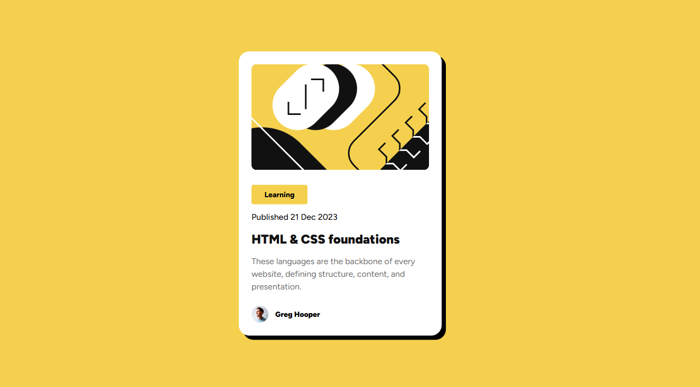

# Frontend Mentor - Blog preview card solution

This is a solution to the [Blog preview card challenge on Frontend Mentor](https://www.frontendmentor.io/challenges/blog-preview-card-ckPaj01IcS). Frontend Mentor challenges help you improve your coding skills by building realistic projects. 

## Table of contents

- [Overview](#overview)
  - [The challenge](#the-challenge)
  - [Screenshot](#screenshot)
  - [Links](#links)
- [My process](#my-process)
  - [Built with](#built-with)
  - [Useful resources](#useful-resources)
- [Author](#author)

## Overview

### The challenge
Users should be able to:

- See hover and focus states for all interactive elements on the page

### Screenshot

### Links

- Solution URL: [Add solution URL here](https://your-solution-url.com)
- Live Site URL: [Add live site URL here](https://your-live-site-url.com)

## My process

### Built with

- Semantic HTML5 markup
- CSS custom properties
- CSS Grid

### Useful resources

- [Freecodecamp](https://www.freecodecamp.org/) - I learned HTML Through this Website. They teach by doing small project which helped me going forward.
- [@supersimpledev](https://youtu.be/G3e-cpL7ofc) - Through this youtube channel i learned basics of CSS. He teachs HTML and CSS by giving me a lots of excercises which helped me to understand CSS.

## Author

- Website - [Joynal Abedin Rakin](https://rakin003.github.io/Rakin_Code_Workshop/)
