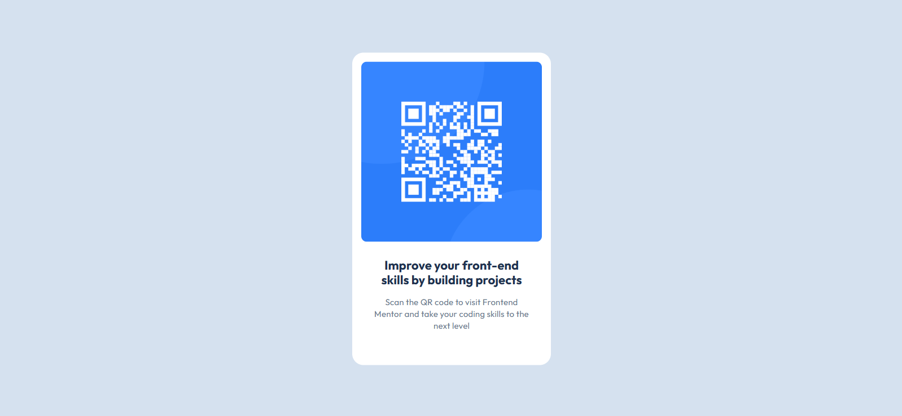

# Frontend Mentor - QR code component solution

This is a solution to the [QR code component challenge on Frontend Mentor](https://www.frontendmentor.io/challenges/qr-code-component-iux_sIO_H). Frontend Mentor challenges help you improve your coding skills by building realistic projects. 

## Table of contents

- [Overview](#overview)
  - [Screenshot](#screenshot)
  - [Links](#links)
- [My process](#my-process)
  - [Built with](#built-with)
  - [What I learned](#what-i-learned)
  - [Useful resources](#useful-resources)
- [Author](#author)

## Overview

### Screenshot



### Links

- Solution URL: [Add solution URL here](https://your-solution-url.com)
- Live Site URL: [Add live site URL here](https://your-live-site-url.com)

## My process

### Built with

- Semantic HTML5 markup
- CSS custom properties
- Mobile-first workflow
- CSS position
- CSS Variables
- [Text Font](https://fonts.google.com/specimen/Outfit) - For styles

### What I learned

I learned Three things by doing this project.
1. Basic CSS
2. CSS variable Usage
3. Centering ``` div ``` 

Usage of CSS variable Code Snippet:
```css
:root {
    --fontname: "Outfit", sans-serif;
}
.title {
    font-family: var(--fontname);
}
```
Centering ``` div ``` Code Snippet:
```css
.card-container {
  position: absolute;
  top: 50%;
  left: 50%;
  transform: translate(-50%, -50%);
}
```
### Useful resources

- [Freecodecamp](https://www.freecodecamp.org/) - I learned HTML Through this Website. They teach by doing small project which helped me going forward.
- [@supersimpledev](https://youtu.be/G3e-cpL7ofc) - Through this youtube channel i learned basics of CSS. He teachs HTML and CSS by giving me a lots of excercises which helped me to understand CSS.
## Author

- Website - [Joynal Abedin Rakin](https://rakin003.github.io/Rakin_Code_Workshop/)

