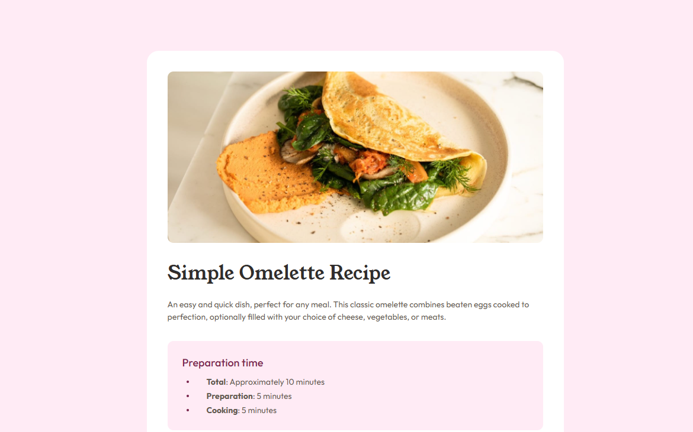
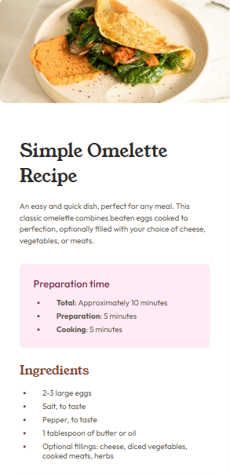

# Frontend Mentor - Recipe page solution

This is a solution to the [Recipe page challenge on Frontend Mentor](https://www.frontendmentor.io/challenges/recipe-page-KiTsR8QQKm). Frontend Mentor challenges help you improve your coding skills by building realistic projects. 

## Table of contents

- [Overview](#overview)
  - [The challenge](#the-challenge)
  - [Screenshot](#screenshot)
  - [Links](#links)
- [My process](#my-process)
  - [Built with](#built-with)
  - [What I learned](#what-i-learned)
  - [Useful resources](#useful-resources)
- [Author](#author)

**Note: Delete this note and update the table of contents based on what sections you keep.**

## Overview

### The challenge

- Make the website responsive for all users

### Screenshot

<figure>
  
  <figcaption>Desktop Version</figcaption>
  
  <figcaption>Mobile Version</figcaption>
</figure>

### Links

- [Live Site]()

## My process

### Built with

- Semantic HTML5 markup
- CSS custom properties
- Mobile-first workflow
- CSS Positioning 

### What I learned

Through this project heres the few things i learned:
- **Make a Website Responsite**: Making a website flexable for every device was a challage. Where i never knew much about responsive design. Revewing through W3schools article helped me to understand how to design an responsite project.
- **Desinging Lists with CSS positioning**: I learned better use of positioning by creating list without using ```<ul>``` and ```<ol>``` tag.

### Useful resource

- [Freecodecamp](https://www.freecodecamp.org/) - I learned HTML Through this Website. They teach by doing small project which helped me going forward.
- [@supersimpledev](https://youtu.be/G3e-cpL7ofc) - Through this youtube channel i learned basics of CSS. He teachs HTML and CSS by giving me a lots of excercises which helped me to understand CSS.
- [Media Quiries](https://www.w3schools.com/css/css3_mediaqueries.asp) - This helped me learn Basics of responsive design.
- [CSS Counters](https://www.w3schools.com/css/css_counters.asp) - This helped me to design lists without using html list tags.

## Author

- Website - [Joynal Abedin Rakin](https://rakin003.github.io/Rakin_Code_Workshop/)


