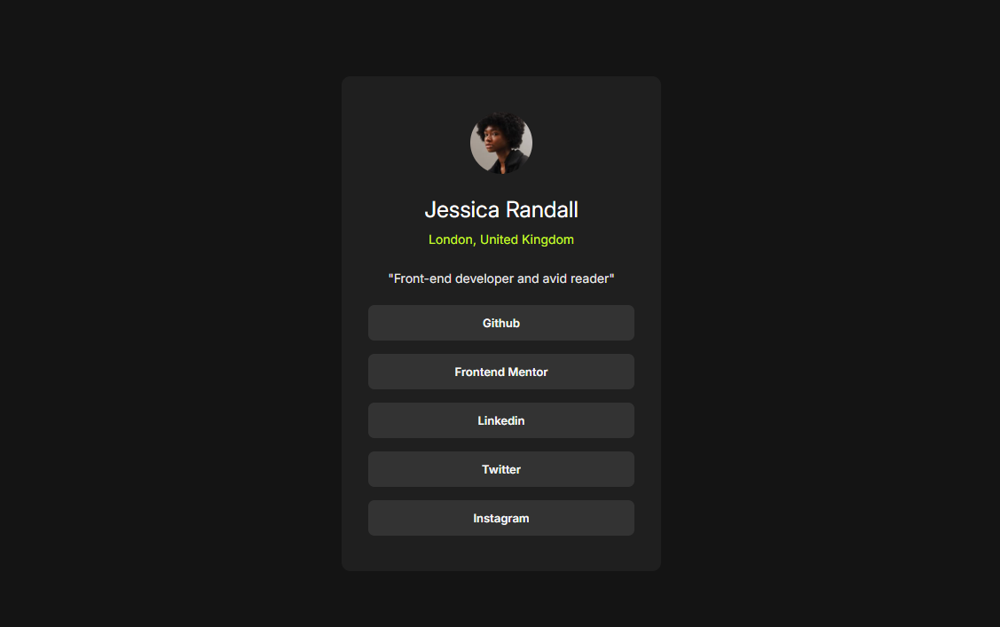

# Frontend Mentor - Social links profile solution

This is a solution to the [Social links profile challenge on Frontend Mentor](https://www.frontendmentor.io/challenges/social-links-profile-UG32l9m6dQ). Frontend Mentor challenges help you improve your coding skills by building realistic projects. 

## Table of contents

- [Overview](#overview)
  - [Screenshot](#screenshot)
  - [Links](#links)
- [My process](#my-process)
  - [Built with](#built-with)
  - [Useful resources](#useful-resources)
- [Author](#author)

## Overview

### Screenshot

<!--  -->

  

### Links

- Solution URL: [Add solution URL here](https://your-solution-url.com)
- Live Site URL: [Add live site URL here](https://your-live-site-url.com)

## My process

### Built with

- Semantic HTML5 markup
- CSS custom properties
- CSS Grid
- CSS Positioning
- Style Component : [Font Family](https://fonts.google.com/share?selection.family=Inter:ital,opsz,wght@0,14..32,100..900;1,14..32,100..900)

### Useful resources

- [Freecodecamp](https://www.freecodecamp.org/) - I learned HTML Through this Website. They teach by doing small project which helped me going forward.
- [@supersimpledev](https://youtu.be/G3e-cpL7ofc) - Through this youtube channel i learned basics of CSS. He teachs HTML and CSS by giving me a lots of excercises which helped me to understand CSS.
## Author

- Website - [Joynal Abedin Rakin](https://rakin003.github.io/Rakin_Code_Workshop/)
